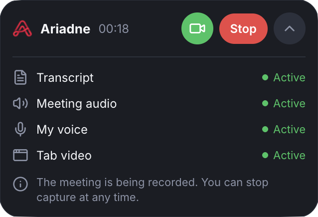

<p align="center">
  
</p>

<h1 align="center">Ariadne - Meeting Recorder</h1>

<p align="center">
  Automatically record, transcribe, and save your meetings locally - no cloud, no subscriptions.
</p>

<p align="center">
  
</p>

## What it does

Ariadne is a Chrome extension that sits quietly in the background during your meetings and saves a complete local record of each one:

- **Transcript** - captured live from the meeting platform's own captions, with each line attributed to whoever spoke it.
- **Audio** - your voice and everyone else's, mixed into a single file automatically, so you get one recording per meeting instead of juggling separate tracks.
- **Video** - an optional, one-click recording of the meeting tab itself (screen shares, participant tiles, everything visible), for when a transcript and audio aren't enough.

Everything is written straight to your browser's local storage. Nothing is uploaded anywhere, and there's no account, no server, and no subscription - the extension has no idea any of this data exists once it's on your disk, because it never leaves your machine in the first place.

**Currently supported:** Google Meet. The architecture isn't tied to any one platform, and support for others may follow.

## Features

- **Fully automatic capture** - recording starts the moment a meeting is detected, with no click required (this can be turned off in Settings if you'd rather start recordings manually).
- **One combined audio file** - your microphone and everyone else's voices, mixed in real time into a single track, so there's nothing to sync up afterward.
- **Mute-aware** - periods where you had your mic muted don't get recorded as silence; a separate mute log lets you reconstruct exactly when you were on and off mic.
- **Live transcript**, attributed per speaker, saved as a plain text file alongside the recording.
- **Optional video capture**, one click away from a banner that appears the moment a meeting starts recording - Chrome requires that click (there's no way around its screen-share confirmation dialog), but everything else about the flow is designed to get out of your way.
- **A real history view** - every past meeting, searchable by title, filterable by date/type, with inline audio/video playback and one-click download of any file.
- **Nothing leaves your device.** No analytics, no third-party requests, no cloud storage. Recordings live in the browser's private local storage until you choose to export them.
- **No visible indication to other participants** that a recording is happening - this is a personal note-taking tool, not a meeting-bot.
- Available in **English, Spanish, and French**, auto-detected from your browser's language.

## Installation

Ariadne isn't published on the Chrome Web Store (it's a personal project, not a distributed product), so you'll load it as an unpacked extension:

```bash
git clone <this-repo-url>
cd ariadne
npm install
npm run build
```

Then in Chrome:

1. Go to `chrome://extensions`.
2. Turn on **Developer mode** (top right).
3. Click **Load unpacked** and select the project folder.

The extension icon will appear in your toolbar. Re-run `npm run build` and reload the extension from `chrome://extensions` after pulling any code changes.

## Usage

1. Join a Google Meet call. Ariadne detects it automatically and starts recording audio and the transcript right away (as long as auto-start is enabled in Settings - it is by default).
2. A small banner appears in the corner of the meeting, showing that recording is active and offering a one-click **Enable video** button if you also want a video file for that meeting.
3. When you leave the meeting or click **Stop**, the recording finalizes and shows up in your history.
4. Click the extension icon and then **View history** to browse past meetings - search, filter, play back audio/video inline, read the transcript, or download any file to your computer.

## Privacy

Everything Ariadne captures stays on your device, in the browser's own private storage for the extension. There is no backend, no account system, and no network request that sends your meeting content anywhere. You decide what to do with a recording - the History page's download button is the only way any of this data leaves the extension's storage.

## Known limitations

- **Google Meet only, for now.** Other platforms aren't supported yet.
- **Video requires one click per meeting.** Chrome's screen-capture APIs always require explicit user confirmation for security reasons - there's no permission or flag that removes this, so it can't be made fully automatic like audio and transcript are.
- **A faint echo is possible when recording with your speaker and microphone (not headphones) at the same time.** If your mic picks up a bit of what's coming out of your speaker, that leaks into the mix - the browser's own echo cancellation reduces this but can't fully eliminate it on every device. Using headphones avoids this entirely.
- **Depends on Google Meet's own interface and internals** (caption panel structure, how it sets up its audio connections). If Meet changes something significant, some part of the capture may need updating.

## Tech stack

Vanilla JavaScript, no framework - Manifest V3 Chrome extension.

- **Capture:** WebRTC interception (`RTCPeerConnection`/`getUserMedia` patched in the page's own context) mixed in real time with the Web Audio API, rather than Chrome's screen/tab-capture APIs (which always require a user prompt).
- **Transcript:** a `MutationObserver` over Google Meet's live captions panel.
- **Storage:** the Origin Private File System (OPFS), scoped to the extension - no filesystem permission prompts, no expiring access.
- **Audio/video conversion:** [`ffmpeg.wasm`](https://ffmpegwasm.netlify.app/) running in an offscreen document, converting the raw recordings to `.mp3`/`.mp4`.
- **Build:** [`esbuild`](https://esbuild.github.io/) for the content-script bundles.
- **Tests:** [Vitest](https://vitest.dev/).

## Development

```bash
npm test          # run the test suite
npm run build     # rebuild the content script bundles
```

Each meeting's captured data lives under its own folder in OPFS; conversions to `.mp3`/`.mp4` happen automatically once a recording finishes.

---

<p align="center"><sub>A personal project - not affiliated with Google or Google Meet.</sub></p>
